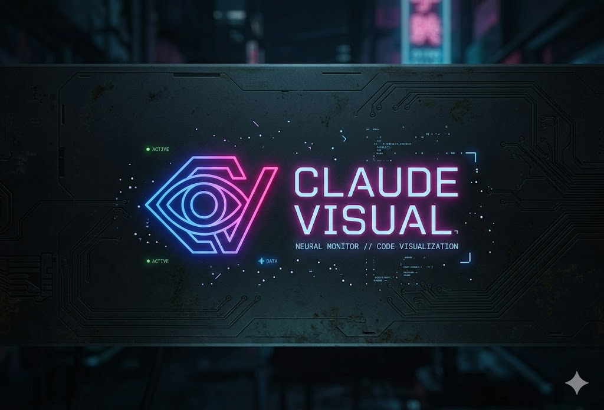

# Claude Visual



Real-time neural monitor for Claude Code agent activity. Tracks events, tool usage, subagent processes, and token consumption with cost estimation — all through a cyberpunk-themed dashboard. Available as a web app or native desktop application (macOS, Windows, Linux) via Tauri.

   

## Features

- **Live Event Feed** — real-time stream of all Claude Code hook events (tool calls, prompts, notifications, stops)
- **Token Tracking** — reads token usage directly from session transcripts with per-session breakdown (input, output, cache read, cache write)
- **Cost Estimation** — calculates estimated cost based on Claude Opus 4 pricing ($15/MTok input, $75/MTok output, $18.75/MTok cache write, $1.50/MTok cache read)
- **Agent Processes** — tracks subagent lifecycle (start/stop, duration, type) with active/completed states
- **Tool Statistics** — visualizes tool usage frequency across sessions
- **Session Management** — filter dashboard by individual Claude Code sessions
- **WebSocket Updates** — instant UI updates via WebSocket connection to the backend
- **Native Desktop App** — cross-platform desktop builds via Tauri 2 with bundled sidecar server

## Architecture

```text
~/.claude/settings.json          Claude Code hooks (fire on every event)
        │
        ▼
  POST /api/events               Bun + Hono server (port 3200)
        │
        ├── EventStore            In-memory event storage (last 2000 events)
        ├── TranscriptTokenReader Reads token usage from .jsonl transcripts
        │
        ▼
   WebSocket /ws                  Broadcasts to connected clients
        │
        ▼
   React Dashboard                Vite + React + Tailwind CSS
        │
        └── (optional) Tauri      Native window wrapping the frontend
                │                  with bundled sidecar server binary
                └── Sidecar        Compiled Bun server, auto-started
                                   on launch, killed on window close
```

## Quick Start (Web)

### Prerequisites

- [Bun](https://bun.sh) v1.3+
- Claude Code CLI with hooks support

### 1. Install dependencies

```bash
bun install
```

### 2. Install Claude Code hooks

```bash
bash hooks/install.sh
```

This merges monitoring hooks into `~/.claude/settings.json`. A backup of your existing settings is created automatically.

### 3. Start the monitor

```bash
bun run dev
```

This starts both the backend server (port 3200) and Vite dev server concurrently.

### 4. Use Claude Code

Open any Claude Code session — events will appear in the dashboard in real-time.

## Desktop App (Tauri)

### Prerequisites

- Everything from the web setup above
- [Rust](https://rustup.rs) toolchain (stable)
- Platform-specific dependencies:
  - **Linux**: `libwebkit2gtk-4.1-dev`, `libappindicator3-dev`, `librsvg2-dev`, `patchelf`, `libfuse2`
  - **macOS / Windows**: no extra dependencies

### Development

```bash
bun run tauri:dev
```

Opens a native Tauri window pointing at the Vite dev server. The Hono backend is started automatically by `dev.ts` — the Rust sidecar is only spawned in release builds.

### Production Build

```bash
bun run tauri:build
```

This compiles the Bun server into a standalone sidecar binary, builds the frontend with Vite, and bundles everything into a platform-native installer (`.dmg` on macOS, `.msi`/`.exe` on Windows, `.deb` on Linux).

### How the Desktop App Works

In production, the Tauri app:

1. **Spawns the sidecar** — the Bun server compiled to a standalone binary, handling the REST API and WebSocket on port 3200
2. **Loads the frontend** — pre-built React app served from the bundled `dist/` directory
3. **Cleans up on exit** — kills the sidecar process when the main window is closed

## Production Build (Web Only)

```bash
bun run build
bun run start
```

Builds the frontend with Vite, then serves everything from the Bun server on port 3200.

## How It Works

Claude Code [hooks](https://docs.anthropic.com/en/docs/claude-code/hooks) fire shell commands on every event (tool use, prompt submit, agent start/stop, etc.). Each hook pipes the full event JSON to the monitor's REST API.

Token usage is **not** included in hook payloads — instead, every hook event includes a `transcript_path` pointing to the session's JSONL transcript file. The server reads new entries from the transcript on each event, extracting `message.usage` data from assistant responses.

## Project Structure

```text
server/
  index.ts              Hono server, WebSocket, REST API
  events.ts             EventStore — in-memory event & agent tracking
  transcript.ts         TranscriptTokenReader — reads tokens from .jsonl files
shared/
  types.ts              Shared TypeScript interfaces
  tokens.ts             Token extraction utilities
src/
  App.tsx               Main React component
  hooks/
    useWebSocket.ts     WebSocket connection & state management
  components/
    Header.tsx          Top bar with global stats
    EventFeed.tsx       Live event stream
    TokenPanel.tsx      Token consumption & cost breakdown
    AgentTimeline.tsx   Subagent process tracking
    ToolStats.tsx       Tool usage frequency
    StatsPanel.tsx      Session statistics
    SessionSelector.tsx Session filter dropdown
src-tauri/
  src/
    main.rs             Rust entry point
    lib.rs              Tauri app setup — sidecar lifecycle management
  tauri.conf.json       Tauri configuration (window, CSP, sidecar, bundle)
  capabilities/         Permission definitions (shell:execute, shell:kill)
  icons/                App icons for all platforms (macOS, Windows, Linux, iOS, Android)
  Cargo.toml            Rust dependencies
hooks/
  claude-hooks.json     Hook definitions template
  install.sh            Installer script
.github/
  workflows/
    release.yml         CI/CD — multi-platform Tauri builds on tag push
```

## CI/CD

The project uses GitHub Actions to build desktop releases. Pushing a `v*` tag triggers builds across four targets:

| Platform | Installer format | Runner |
| --- | --- | --- |
| Linux x86_64 | `.deb` | ubuntu-22.04 |
| Windows x86_64 | `.msi` / `.exe` | windows-latest |
| macOS ARM (Apple Silicon) | `.dmg` | macos-latest |
| macOS Intel | `.dmg` | macos-latest |

Artifacts are uploaded to a draft GitHub Release.

## Configuration

| Variable | Default | Description |
| --- | --- | --- |
| `PORT` | `3200` | Server & WebSocket port |
| `NODE_ENV` | — | Set to `production` for static file serving |
| `DEBUG_TOKENS` | — | Set to `1` to log token extraction to console |

## Scripts

| Script | Description |
| --- | --- |
| `bun run dev` | Start backend + Vite dev server |
| `bun run dev:server` | Backend only (watch mode) |
| `bun run dev:client` | Vite dev server only |
| `bun run build` | Production frontend build |
| `bun run start` | Production server (serves `dist/`) |
| `bun run tauri:dev` | Tauri desktop app in dev mode |
| `bun run tauri:build` | Full desktop app build with sidecar |
| `bun run tauri:sidecar` | Compile server to standalone sidecar binary |

## Tech Stack

- **Runtime**: [Bun](https://bun.sh)
- **Backend**: [Hono](https://hono.dev)
- **Frontend**: [React 19](https://react.dev) + [Vite 7](https://vite.dev) + [Tailwind CSS v4](https://tailwindcss.com)
- **Desktop**: [Tauri 2](https://tauri.app) (Rust + WebView)
- **Transport**: WebSocket (native Bun)
- **CI/CD**: GitHub Actions + `tauri-apps/tauri-action`

## License

MIT
